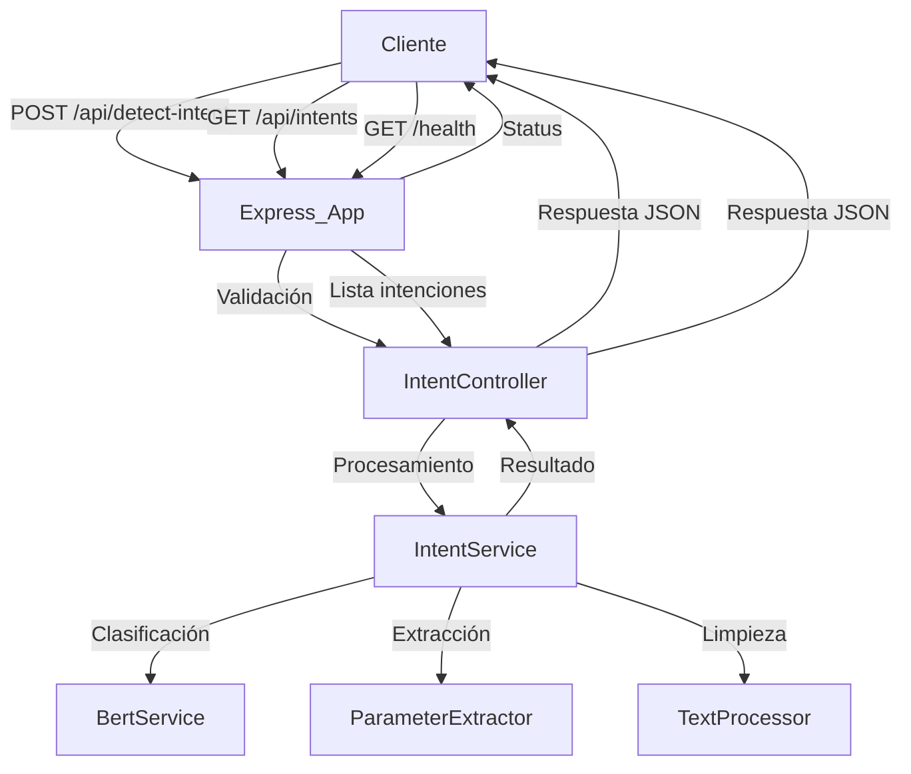

# Arquitectura del Microservicio de Detección de Intenciones

## Resumen General
Este microservicio Node.js utiliza BERT (Bidirectional Encoder Representations from Transformers) para detectar intenciones y extraer parámetros de comandos a partir de texto de entrada. El servicio analiza el texto y clasifica la intención, extrayendo parámetros específicos según el patrón detectado.

## Estructura de Carpetas Actual

```
agente-deteccion-intencion/
├── src/
│   ├── index.js                 # Punto de entrada del servidor
│   ├── routes/
│   │   └── intent.js            # Rutas de la API REST
│   ├── controllers/
│   │   └── intentController.js  # Lógica de negocio para detección
│   ├── services/
│   │   ├── bertService.js       # Servicio de integración con BERT
│   │   └── intentService.js     # Lógica de clasificación de intenciones
│   ├── models/
│   │   ├── intent.js            # Modelo de datos para intenciones
│   │   └── parameter.js         # Modelo de datos para parámetros
│   ├── config/
│   │   ├── bert.js              # Configuración del modelo BERT
│   │   └── intents.js           # Configuración de intenciones y patrones
│   ├── utils/
│   │   ├── textProcessor.js     # Utilidades de procesamiento de texto
│   │   └── parameterExtractor.js # Extracción de parámetros
│   └── middleware/
│       ├── validation.js        # Validación de entrada
│       └── errorHandler.js      # Manejo de errores
├── tests/
│   ├── unit/                    # Tests unitarios
│   ├── integration/             # Tests de integración
│   ├── integration-setup.js     # Configuración de tests de integración
│   ├── env.js                   # Variables de entorno para tests
│   └── setup.js                 # Configuración general de tests
├── models/
│   └── bert-model/              # Modelo BERT entrenado
├── data/
│   ├── intents.json             # Definición de intenciones
│   └── training-data.json       # Datos de entrenamiento
├── coverage/                    # Reportes de cobertura de tests
├── load-test.js                 # Script de pruebas de carga
├── memory-test.js               # Script de pruebas de memoria
├── test-api.html                # Interfaz web para probar la API
├── test-demo.js                 # Script de demostración
├── debug-test.js                # Script de debugging
├── package.json
├── jest.config.js               # Configuración de Jest
├── .env
├── .gitignore
└── documentacion/
    └── arquitectura.md          # Este archivo
```

## Flujo de Funcionamiento

### 1. Recepción de Petición
```
POST /api/detect-intent
Content-Type: application/json

{
  "text": "buscar producto laptop"
}
```

### 2. Procesamiento
1. **Validación**: Se valida el formato de entrada
2. **Preprocesamiento**: Limpieza y normalización del texto
3. **Clasificación**: El servicio de intenciones clasifica la intención
4. **Extracción de Parámetros**: Se extraen parámetros según patrones
5. **Respuesta**: Se formatea y retorna el resultado

### 3. Respuesta
```json
{
  "success": true,
  "data": {
    "intent": "BUSQUEDA",
    "confidence": 0.95,
    "pattern": "buscar {nombre_producto}",
    "parameters": {
      "nombre_producto": "laptop"
    },
    "originalText": "buscar producto laptop"
  }
}
```

## Especificaciones Técnicas

### API Endpoints

#### POST /api/detect-intent
**Descripción**: Detecta intención y extrae parámetros del texto de entrada

**Request Body**:
```json
{
  "text": "string (requerido)"
}
```

**Response**:
```json
{
  "success": true,
  "data": {
    "intent": "string",          // ID de la intención o null
    "confidence": "number",       // Nivel de confianza (0-1)
    "pattern": "string",          // Patrón que coincidió
    "parameters": {               // Objeto con parámetros extraídos
      "param_name": "value"
    },
    "originalText": "string"      // Texto original de entrada
  }
}
```

#### GET /api/intents
**Descripción**: Obtiene todas las intenciones disponibles

**Response**:
```json
{
  "success": true,
  "data": [
    {
      "id": "BUSQUEDA",
      "name": "Búsqueda de productos",
      "patterns": ["buscar {nombre_producto}", "encontrar {nombre_producto}"],
      "parameters": {
        "nombre_producto": {
          "type": "string",
          "required": true
        }
      }
    }
  ]
}
```

#### GET /health
**Descripción**: Health check del servicio

**Response**:
```json
{
  "status": "OK",
  "timestamp": "2024-01-01T00:00:00.000Z",
  "service": "Agente de Detección de Intención"
}
```

#### GET /
**Descripción**: Información del servicio

**Response**:
```json
{
  "service": "Agente de Detección de Intención",
  "version": "1.0.0",
  "endpoints": {
    "POST /api/detect-intent": "Detectar intención y extraer parámetros",
    "GET /api/intents": "Obtener todas las intenciones disponibles",
    "GET /health": "Health check del servicio"
  }
}
```

### Configuración de Intenciones

```javascript
// config/intents.js
const INTENTS = {
  BUSQUEDA: {
    id: "BUSQUEDA",
    patterns: [
      "buscar {nombre_producto}",
      "encontrar {nombre_producto}",
      "producto {nombre_producto}"
    ],
    parameters: {
      nombre_producto: {
        type: "string",
        required: true
      }
    }
  },
  // Otras intenciones...
}
```

## Dependencias Principales

### Dependencias de Producción
- **express**: Framework web para Node.js
- **@tensorflow/tfjs-node**: TensorFlow.js para Node.js
- **@huggingface/inference**: Cliente para modelos Hugging Face
- **natural**: Procesamiento de lenguaje natural
- **joi**: Validación de esquemas
- **dotenv**: Variables de entorno
- **axios**: Cliente HTTP
- **compression**: Compresión de respuestas
- **cors**: Cross-Origin Resource Sharing
- **helmet**: Seguridad HTTP
- **morgan**: Logging de requests

### Dependencias de Desarrollo
- **jest**: Framework de testing
- **nodemon**: Reinicio automático en desarrollo
- **eslint**: Linting de código
- **supertest**: Testing de APIs

## Arquitectura de Componentes

### 1. IntentService
- Lógica de clasificación principal
- Mapeo de intenciones
- Gestión de patrones y coincidencias
- Cálculo de confianza

### 2. BertService
- Integración con modelo BERT
- Clasificación de intenciones
- Procesamiento de embeddings

### 3. ParameterExtractor
- Extracción de parámetros
- Validación de tipos
- Procesamiento de patrones

### 4. TextProcessor
- Limpieza de texto
- Normalización
- Tokenización

### 5. IntentController
- Manejo de requests HTTP
- Validación de entrada
- Formateo de respuestas

## Diagrama de Flujo



## Casos de Uso

### Caso 1: Intención Detectada
**Input**: "buscar laptop gaming"
**Output**:
```json
{
  "success": true,
  "data": {
    "intent": "BUSQUEDA",
    "confidence": 0.95,
    "pattern": "buscar {nombre_producto}",
    "parameters": {
      "nombre_producto": "laptop gaming"
    },
    "originalText": "buscar laptop gaming"
  }
}
```

### Caso 2: Sin Intención Detectada
**Input**: "hola como estás"
**Output**:
```json
{
  "success": true,
  "data": {
    "intent": null,
    "confidence": 0,
    "parameters": {},
    "originalText": "hola como estás"
  }
}
```

### Caso 3: Error de Validación
**Input**: `{}` (sin campo text)
**Output**:
```json
{
  "success": false,
  "error": "El campo \"text\" es requerido y debe ser una cadena de texto"
}
```

## Scripts y Herramientas

### Scripts de Desarrollo
- `npm start`: Inicia el servidor en producción
- `npm run dev`: Inicia el servidor en modo desarrollo con nodemon
- `npm test`: Ejecuta todos los tests
- `npm run test:unit`: Ejecuta solo tests unitarios
- `npm run test:integration`: Ejecuta solo tests de integración
- `npm run lint`: Ejecuta ESLint
- `npm run lint:fix`: Corrige errores de ESLint automáticamente

### Scripts de Pruebas
- `load-test.js`: Pruebas de carga del servicio
- `memory-test.js`: Pruebas de uso de memoria
- `test-demo.js`: Demostración de funcionalidades
- `debug-test.js`: Herramientas de debugging
- `test-api.html`: Interfaz web para probar endpoints

## Consideraciones de Implementación

### Rendimiento
- Caché de resultados frecuentes
- Procesamiento asíncrono
- Optimización del modelo BERT
- Compresión de respuestas HTTP

### Escalabilidad
- Arquitectura stateless
- Load balancing
- Monitoreo de métricas
- Health checks automáticos

### Mantenibilidad
- Configuración externa de intenciones
- Logs estructurados
- Tests automatizados (unitarios e integración)
- Cobertura de código con Jest

### Seguridad
- Validación de entrada con Joi
- Headers de seguridad con Helmet
- CORS configurado
- Sanitización de datos

---

> Para implementación detallada, revisar los archivos fuente en `src/` y la configuración en `config/`.
