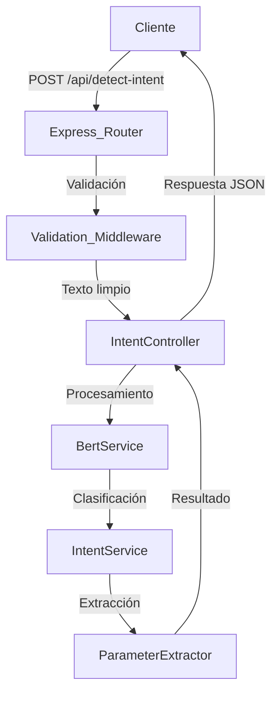

# Arquitectura del Microservicio de Detección de Intenciones

## Resumen General
Este microservicio Node.js utiliza BERT (Bidirectional Encoder Representations from Transformers) para detectar intenciones y extraer parámetros de comandos a partir de texto de entrada. El servicio analiza el texto y clasifica la intención, extrayendo parámetros específicos según el patrón detectado.

## Estructura de Carpetas Propuesta

```
agente-deteccion-intencion/
├── src/
│   ├── index.js                 # Punto de entrada del servidor
│   ├── routes/
│   │   └── intent.js            # Rutas de la API REST
│   ├── controllers/
│   │   └── intentController.js  # Lógica de negocio para detección
│   ├── services/
│   │   ├── bertService.js       # Servicio de integración con BERT
│   │   └── intentService.js     # Lógica de clasificación de intenciones
│   ├── models/
│   │   ├── intent.js            # Modelo de datos para intenciones
│   │   └── parameter.js         # Modelo de datos para parámetros
│   ├── config/
│   │   ├── bert.js              # Configuración del modelo BERT
│   │   └── intents.js           # Configuración de intenciones y patrones
│   ├── utils/
│   │   ├── textProcessor.js     # Utilidades de procesamiento de texto
│   │   └── parameterExtractor.js # Extracción de parámetros
│   └── middleware/
│       ├── validation.js        # Validación de entrada
│       └── errorHandler.js      # Manejo de errores
├── tests/
│   ├── unit/
│   └── integration/
├── models/
│   └── bert-model/              # Modelo BERT entrenado
├── data/
│   ├── intents.json             # Definición de intenciones
│   └── training-data.json       # Datos de entrenamiento
├── package.json
├── .env
├── .gitignore
└── documentacion/
    └── arquitectura.md          # Este archivo
```

## Flujo de Funcionamiento

### 1. Recepción de Petición
```
POST /api/detect-intent
Content-Type: application/json

{
  "text": "buscar producto laptop"
}
```

### 2. Procesamiento
1. **Validación**: Se valida el formato de entrada
2. **Preprocesamiento**: Limpieza y normalización del texto
3. **Clasificación BERT**: El modelo BERT clasifica la intención
4. **Extracción de Parámetros**: Se extraen parámetros según patrones
5. **Respuesta**: Se formatea y retorna el resultado

### 3. Respuesta
```json
{
  "command": "BUSQUEDA",
  "params_list": {
    "nombre_producto": "laptop"
  }
}
```

## Especificaciones Técnicas

### API Endpoints

#### POST /api/detect-intent
**Descripción**: Detecta intención y extrae parámetros del texto de entrada

**Request Body**:
```json
{
  "text": "string (requerido)"
}
```

**Response**:
```json
{
  "command": "string",     // ID de la intención o "none"
  "params_list": {         // Objeto con parámetros extraídos
    "param_name": "value"
  }
}
```

### Configuración de Intenciones

```javascript
// config/intents.js
const INTENTS = {
  BUSQUEDA: {
    id: "BUSQUEDA",
    patterns: [
      "buscar {nombre_producto}",
      "encontrar {nombre_producto}",
      "producto {nombre_producto}"
    ],
    parameters: {
      nombre_producto: {
        type: "string",
        required: true
      }
    }
  },
  // Otras intenciones...
}
```

## Dependencias Principales

- **express**: Framework web para Node.js
- **@tensorflow/tfjs-node**: TensorFlow.js para Node.js
- **@huggingface/inference**: Cliente para modelos Hugging Face
- **natural**: Procesamiento de lenguaje natural
- **joi**: Validación de esquemas
- **dotenv**: Variables de entorno

## Arquitectura de Componentes

### 1. BertService
- Integración con modelo BERT
- Clasificación de intenciones
- Procesamiento de embeddings

### 2. IntentService
- Lógica de clasificación
- Mapeo de intenciones
- Gestión de patrones

### 3. ParameterExtractor
- Extracción de parámetros
- Validación de tipos
- Procesamiento de patrones

### 4. TextProcessor
- Limpieza de texto
- Normalización
- Tokenización

## Diagrama de Flujo



## Casos de Uso

### Caso 1: Intención Detectada
**Input**: "buscar laptop gaming"
**Output**:
```json
{
  "command": "BUSQUEDA",
  "params_list": {
    "nombre_producto": "laptop gaming"
  }
}
```

### Caso 2: Sin Intención Detectada
**Input**: "hola como estás"
**Output**:
```json
{
  "command": "none",
  "params_list": {}
}
```

## Consideraciones de Implementación

### Rendimiento
- Caché de resultados frecuentes
- Procesamiento asíncrono
- Optimización del modelo BERT

### Escalabilidad
- Arquitectura stateless
- Load balancing
- Monitoreo de métricas

### Mantenibilidad
- Configuración externa de intenciones
- Logs estructurados
- Tests automatizados

---

> Para implementación detallada, revisar los archivos fuente en `src/` y la configuración en `config/`.
