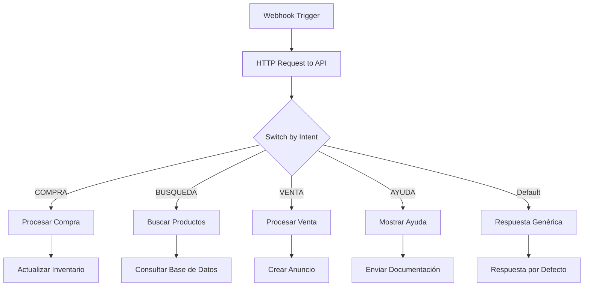

# 🔗 Integración con n8n

## 📝 Resumen Práctico de Integración

- **Endpoints listos para n8n:**
  - `POST /api/n8n/detect-intent` (respuesta rica, con contexto)
  - `POST /api/n8n/webhook` (respuesta simple)
  - `GET /api/n8n/info` (metadatos del servicio)

- **En n8n:**
  1. Crea un workflow con un nodo HTTP Request apuntando a tu endpoint (por ejemplo, `/api/n8n/detect-intent`).
  2. Envía el texto a analizar en el body, junto con cualquier contexto adicional.
  3. Usa un nodo Switch para ramificar el flujo según la intención detectada (`$json.data.intent`).
  4. Añade nodos de acción según la intención (enviar email, consultar base de datos, etc).

- **Ejemplo de payload para el nodo HTTP Request:**
  ```json
  {
    "text": "quiero comprar una laptop",
    "method": "hybrid",
    "context": {
      "userId": "12345",
      "sessionId": "abc123"
    }
  }
  ```

- **Ejemplo de uso en n8n:**
  - Nodo HTTP Request → Switch por intención → Acciones específicas.

- **Documentación y ejemplos:**
  - Consulta este archivo para ver ejemplos de payload, respuesta y flujos recomendados.
  - Puedes importar el workflow de ejemplo: `ejemplos/n8n-workflow-example.json`.
  - Prueba la integración con el script: `node ejemplos/test-n8n-integration.js`.

---

## 🛠️ Procedimiento Paso a Paso para la Integración

### 1. **Preparar el microservicio**
- Asegúrate de que el microservicio esté corriendo y accesible en la red (por ejemplo, `http://localhost:3000`).
- Verifica que los endpoints `/api/n8n/detect-intent`, `/api/n8n/webhook` y `/api/n8n/info` estén disponibles.

### 2. **Configurar el workflow en n8n**

#### a) **Crear un nuevo workflow**
- Abre n8n y crea un nuevo workflow.

#### b) **Agregar un nodo HTTP Request**
- Tipo: `HTTP Request`
- Método: `POST`
- URL: `http://localhost:3000/api/n8n/detect-intent`
- Headers: `Content-Type: application/json`
- Body: JSON con el texto a analizar, por ejemplo:
  ```json
  {
    "text": "quiero comprar una laptop",
    "method": "hybrid",
    "context": {
      "userId": "12345",
      "sessionId": "abc123"
    }
  }
  ```

#### c) **Agregar un nodo Switch**
- Tipo: `Switch`
- Condición: `{{$json["data"]["intent"]}}` igual a la intención esperada (por ejemplo, `COMPRA`, `BUSQUEDA`, etc).
- Añade tantas ramas como intenciones quieras manejar.

#### d) **Agregar nodos de acción**
- Por cada intención, conecta un nodo de acción (puede ser otro HTTP Request, Email, base de datos, etc).

#### e) **(Opcional) Importar workflow de ejemplo**
- Puedes importar el archivo `ejemplos/n8n-workflow-example.json` incluido en el repositorio para tener una base lista para usar.

### 3. **Probar la integración**
- Usa el script de ejemplo `node ejemplos/test-n8n-integration.js` para validar que los endpoints respondan correctamente y que la lógica de intenciones funcione como esperas.
- También puedes probar manualmente desde n8n enviando diferentes textos y verificando la respuesta y el flujo.

### 4. **Recomendaciones**
- Ajusta los umbrales de confianza (`confidence`) según tus necesidades.
- Si necesitas contexto adicional, pásalo en el campo `context` del payload.
- Consulta el endpoint `/api/n8n/info` para ver las capacidades y versiones del servicio.
- Si tienes dudas sobre la estructura de la respuesta, revisa los ejemplos en este documento.

---

## 🚀 Endpoints para n8n

### 1. **Detección de Intenciones Completa**
```
POST /api/n8n/detect-intent
```

**Payload:**
```json
{
  "text": "quiero comprar una laptop",
  "method": "hybrid",
  "context": {
    "userId": "12345",
    "sessionId": "abc123",
    "source": "chatbot"
  }
}
```

**Respuesta:**
```json
{
  "success": true,
  "data": {
    "intent": "COMPRA",
    "confidence": 1.0,
    "originalText": "quiero comprar una laptop",
    "method": "hybrid",
    "hasIntent": true,
    "isHighConfidence": true,
    "parameters": {
      "nombre_producto": "comprar una laptop"
    },
    "parameterCount": 1,
    "pattern": "quiero {nombre_producto}",
    "hasPattern": true,
    "hybridDecision": "pattern_matching",
    "bertConfidence": 0.18,
    "patternConfidence": 1.0,
    "context": {
      "userId": "12345",
      "sessionId": "abc123",
      "source": "chatbot"
    },
    "timestamp": "2024-07-08T20:30:00.000Z",
    "shouldRespond": true,
    "intentType": "compra",
    "processingTime": 45,
    "serviceVersion": "2.1.0"
  }
}
```

### 2. **Webhook Simplificado**
```
POST /api/n8n/webhook
```

**Payload:**
```json
{
  "text": "buscar laptop",
  "method": "hybrid"
}
```

**Respuesta:**
```json
{
  "intent": "BUSQUEDA",
  "confidence": 1.0,
  "parameters": {
    "nombre_producto": "laptop"
  },
  "pattern": "buscar {nombre_producto}",
  "method": "hybrid",
  "success": true
}
```

### 3. **Información del Servicio**
```
GET /api/n8n/info
```

**Respuesta:**
```json
{
  "service": "Agente de Detección de Intenciones",
  "version": "2.1.0",
  "status": "active",
  "endpoints": {
    "detect": "/api/n8n/detect-intent",
    "webhook": "/api/n8n/webhook",
    "compare": "/api/compare-methods",
    "train": "/api/train-bert",
    "status": "/api/bert-status"
  },
  "capabilities": {
    "intentDetection": true,
    "parameterExtraction": true,
    "hybridMethod": true,
    "bertLocal": true,
    "patternMatching": true,
    "training": true
  },
  "supportedIntents": ["BUSQUEDA", "COMPRA", "VENTA", "AYUDA", "SALUDO", "DESPEDIDA"],
  "defaultMethod": "hybrid",
  "timestamp": "2024-07-08T20:30:00.000Z"
}
```

## 🔧 Configuración en n8n

### Paso 1: Crear un Workflow

1. **Nodo HTTP Request** (Trigger)
   - Método: `POST`
   - URL: `http://localhost:3000/api/n8n/detect-intent`
   - Headers: `Content-Type: application/json`
   - Body: JSON con el texto a analizar

2. **Nodo Switch** (Condicional)
   - Condición 1: `{{ $json.data.intent === "COMPRA" }}`
   - Condición 2: `{{ $json.data.intent === "BUSQUEDA" }}`
   - Condición 3: `{{ $json.data.intent === "VENTA" }}`
   - Default: Otros casos

3. **Nodos de Acción** (Por cada intención)
   - HTTP Request para APIs externas
   - Base de datos
   - Email/SMS
   - Webhook a otros servicios

### Paso 2: Ejemplo de Workflow



## 📊 Casos de Uso

### 1. **Chatbot Automatizado**
```javascript
// n8n Workflow
const intent = $json.data.intent;
const confidence = $json.data.confidence;
const parameters = $json.data.parameters;

if (confidence > 0.8) {
  switch (intent) {
    case 'COMPRA':
      // Procesar compra
      return { action: 'process_purchase', product: parameters.nombre_producto };
    case 'BUSQUEDA':
      // Buscar productos
      return { action: 'search_products', query: parameters.nombre_producto };
    case 'AYUDA':
      // Mostrar ayuda
      return { action: 'show_help' };
  }
} else {
  return { action: 'ask_clarification' };
}
```

### 2. **Sistema de Tickets**
```javascript
// Clasificar tickets automáticamente
const ticketText = $json.data.originalText;
const intent = $json.data.intent;

const ticketCategory = {
  'COMPRA': 'sales',
  'BUSQUEDA': 'inquiry',
  'AYUDA': 'support',
  'VENTA': 'partnership'
}[intent] || 'general';

return {
  category: ticketCategory,
  priority: $json.data.isHighConfidence ? 'high' : 'medium',
  autoAssign: true
};
```

### 3. **Análisis de Sentimientos**
```javascript
// Combinar con análisis de sentimientos
const intent = $json.data.intent;
const confidence = $json.data.confidence;

// Si es una intención clara, es probablemente positiva
const sentiment = confidence > 0.7 ? 'positive' : 'neutral';

return {
  intent: intent,
  sentiment: sentiment,
  confidence: confidence,
  shouldEscalate: confidence < 0.5
};
```

## 🔄 Flujos de Trabajo Recomendados

### **Flujo 1: Atención al Cliente**
1. **Trigger**: Mensaje de chat/email
2. **Detección**: Analizar intención
3. **Clasificación**: Asignar categoría
4. **Enrutamiento**: Enviar al departamento correcto
5. **Respuesta**: Generar respuesta automática

### **Flujo 2: E-commerce**
1. **Trigger**: Búsqueda en sitio web
2. **Detección**: Identificar intención de compra
3. **Búsqueda**: Consultar inventario
4. **Recomendación**: Sugerir productos similares
5. **Conversión**: Procesar compra

### **Flujo 3: Soporte Técnico**
1. **Trigger**: Ticket de soporte
2. **Detección**: Clasificar tipo de problema
3. **Priorización**: Asignar prioridad
4. **Asignación**: Enviar al técnico correcto
5. **Seguimiento**: Actualizar estado

## ⚙️ Configuración Avanzada

### **Variables de Entorno**
```bash
# n8n Environment Variables
N8N_INTENT_API_URL=http://localhost:3000
N8N_INTENT_API_KEY=your_api_key
N8N_DEFAULT_METHOD=hybrid
N8N_CONFIDENCE_THRESHOLD=0.7
```

### **Headers de Autenticación**
```javascript
// En n8n HTTP Request node
{
  "Content-Type": "application/json",
  "Authorization": "Bearer {{ $env.N8N_INTENT_API_KEY }}",
  "X-Request-ID": "{{ $json.requestId }}"
}
```

### **Manejo de Errores**
```javascript
// En n8n Error Trigger
if ($json.success === false) {
  // Log error
  console.error('Intent detection failed:', $json.error);
  
  // Fallback response
  return {
    intent: 'none',
    confidence: 0,
    parameters: {},
    error: $json.error
  };
}
```

## 📈 Monitoreo y Métricas

### **Métricas a Seguir**
- Tasa de detección exitosa
- Tiempo de respuesta promedio
- Confianza promedio por intención
- Errores por endpoint
- Uso por método de detección

### **Alertas Recomendadas**
- Confianza promedio < 0.6
- Tiempo de respuesta > 2 segundos
- Tasa de error > 5%
- Modelo BERT no disponible

## 🔧 Troubleshooting

### **Problemas Comunes**

1. **Timeout en n8n**
   - Aumentar timeout en HTTP Request node
   - Verificar que el servidor esté respondiendo

2. **Formato de respuesta incorrecto**
   - Verificar Content-Type headers
   - Validar estructura JSON

3. **Baja confianza**
   - Revisar datos de entrenamiento
   - Considerar ajustar umbrales

4. **Errores de conexión**
   - Verificar URL del servidor
   - Comprobar firewall/red

### **Logs de Depuración**
```javascript
// En n8n Function node
console.log('Request:', $json);
console.log('Intent:', $json.data.intent);
console.log('Confidence:', $json.data.confidence);
console.log('Parameters:', $json.data.parameters);
```

## 🚀 Próximos Pasos

1. **Implementar autenticación** con API keys
2. **Agregar rate limiting** para proteger el servicio
3. **Crear webhooks de eventos** para notificaciones
4. **Implementar cache** para mejorar rendimiento
5. **Agregar métricas en tiempo real** con Prometheus/Grafana

---

**Versión**: 2.1.0  
**Última actualización**: 2024-07-08  
**Autor**: Sistema de Detección de Intenciones 